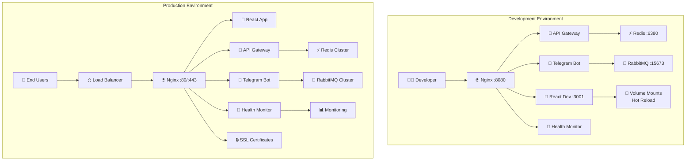

# 🌍 Complete Multi-Environment Deployment Guide

## 📋 Table of Contents
1. [Overview](#-overview)
2. [Environment Architecture](#-environment-architecture)
3. [Prerequisites](#-prerequisites)
4. [Quick Start](#-quick-start)
5. [Detailed Setup](#-detailed-setup)
6. [Configuration Reference](#-configuration-reference)
7. [Security Guidelines](#-security-guidelines)
8. [Monitoring & Maintenance](#-monitoring--maintenance)
9. [Troubleshooting](#-troubleshooting)
10. [Best Practices](#-best-practices)

## 🎯 Overview

GiftMakeBot supports sophisticated multi-environment deployment with complete separation between development and production configurations. Each environment is optimized for its specific use case while maintaining consistency in core functionality.

### 🏗️ Architecture Comparison

| Aspect | Development | Production |
|--------|------------|------------|
| **Purpose** | Local development, testing, debugging | Live deployment, end users |
| **Performance** | Debug-focused, verbose logging | Optimized, minimal logging |
| **Security** | Development credentials, open access | Production secrets, restricted access |
| **Monitoring** | Basic health checks | Comprehensive monitoring |
| **Scalability** | Single instance | Load balanced, clustered |
| **SSL/TLS** | Optional, self-signed | Required, valid certificates |
| **Data Persistence** | Temporary volumes | Persistent storage |

## 🌐 Environment Architecture



## 📋 Prerequisites

### System Requirements

**Minimum Requirements:**
- **RAM**: 4GB (Development), 8GB (Production)
- **CPU**: 2 cores (Development), 4+ cores (Production)
- **Storage**: 10GB (Development), 50GB+ (Production)
- **Network**: Internet connection for Docker images

**Software Dependencies:**
- **Docker Desktop/Engine**: v20.10+ 
- **Docker Compose**: v2.0+
- **Git**: Latest version
- **PowerShell**: 5.1+ (Windows) or **Bash**: 4.0+ (Linux/Mac)

**Account Requirements:**
- **Telegram Bot Token**: From [@BotFather](https://t.me/BotFather)
- **Domain Name**: For production HTTPS (optional for development)
- **SSL Certificate**: For production (Let's Encrypt recommended)

### Pre-Installation Checklist

```bash
# Verify Docker installation
docker --version
docker compose version

# Check system resources
docker system info

# Verify ports are available
netstat -tulpn | grep -E "(80|443|8080|6379|5672)" # Linux/Mac
Get-NetTCPConnection -LocalPort 80,443,8080,6379,5672 # Windows PowerShell
```

## 🚀 Quick Start

### 🔧 Development Environment (5 minutes)

Perfect for local development with hot reload and debugging:

1. **Clone and Setup:**
   ```bash
   git clone https://github.com/blogchik/GiftMakeBot.git
   cd GiftMakeBot
   ```

2. **One-Command Deploy:**
   ```bash
   # Windows PowerShell
   .\deploy-dev.ps1
   
   # Linux/Mac
   chmod +x deploy-dev.sh
   ./deploy-dev.sh
   ```

3. **Verify Deployment:**
   ```bash
   # Check health status
   curl http://localhost:8080/health
   
   # View running services
   docker compose ps
   ```

**Development URLs:**
- 🌐 **Main App**: http://localhost:8080
- 🔗 **API**: http://localhost:8080/api
- 💊 **Health**: http://localhost:8080/health
- 🐰 **RabbitMQ**: http://localhost:15673 (admin/password)

### 🚀 Production Environment (15 minutes)

Enterprise-ready deployment with security and monitoring:

1. **Configure Production Environment:**
   ```bash
   # Copy and edit production config
   cp .env.production .env
   nano .env  # Edit with your production values
   ```

2. **Security Setup:**
   ```bash
   # Update ALL CHANGE_THIS values in .env:
   REDIS_PASSWORD=YourSecureRedisPassword2025
   RABBITMQ_USER=your_production_admin
   RABBITMQ_PASSWORD=YourSecureRabbitMQPassword2025
   TELEGRAM_BOT_TOKEN=your_production_bot_token
   TELEGRAM_SUPER_ADMIN_ID=your_telegram_user_id
   ```

3. **SSL Certificate Setup (Optional):**
   ```bash
   # Create SSL directory
   mkdir ssl
   
   # Add your certificates
   cp your-certificate.pem ssl/cert.pem
   cp your-private-key.key ssl/private.key
   
   # Or use Let's Encrypt
   sudo certbot certonly --standalone -d your-domain.com
   cp /etc/letsencrypt/live/your-domain.com/fullchain.pem ssl/cert.pem
   cp /etc/letsencrypt/live/your-domain.com/privkey.pem ssl/private.key
   ```

4. **Deploy to Production:**
   ```bash
   # Windows PowerShell (as Administrator)
   .\deploy-prod.ps1
   
   # Linux/Mac (with sudo)
   sudo ./deploy-prod.sh
   ```

5. **Verify Production Deployment:**
   ```bash
   # Health check
   curl https://your-domain.com/health
   # or
   curl http://localhost/health
   
   # Check SSL
   curl -I https://your-domain.com
   ```

## 🔧 Detailed Setup

### Environment File Configuration

#### Development Configuration (`.env.development`)

```bash
# ===========================================
# DEVELOPMENT ENVIRONMENT SETTINGS
# ===========================================

# Application
APP_ENV=development
DEBUG=true
LOG_LEVEL=debug

# Network (Non-standard ports to avoid conflicts)
HTTP_PORT=8080
HTTPS_PORT=8443
REDIS_PORT=6380
RABBITMQ_PORT=5673
RABBITMQ_MANAGEMENT_PORT=15673

# Development Features
HOT_RELOAD=true
WATCH_MODE=true
CORS_ENABLED=true
CORS_ORIGINS=http://localhost:3000,http://localhost:8080

# Safe Development Credentials
REDIS_PASSWORD=DevRedis@2025
RABBITMQ_USER=dev_admin
RABBITMQ_PASSWORD=DevRabbitMQ@2025

# Container Names (with dev prefix)
NGINX_CONTAINER_NAME=giftmakebot_dev_nginx
REDIS_CONTAINER_NAME=giftmakebot_dev_redis
RABBITMQ_CONTAINER_NAME=giftmakebot_dev_rabbitmq
```

#### Production Configuration (`.env.production`)

```bash
# ===========================================
# PRODUCTION ENVIRONMENT SETTINGS
# ===========================================

# Application
APP_ENV=production
DEBUG=false
LOG_LEVEL=error

# Network (Standard ports)
HTTP_PORT=80
HTTPS_PORT=443
REDIS_PORT=6379
RABBITMQ_PORT=5672
RABBITMQ_MANAGEMENT_PORT=15672

# Production Features
HOT_RELOAD=false
WATCH_MODE=false
CORS_ENABLED=false
RATE_LIMIT_ENABLED=true
RATE_LIMIT_REQUESTS_PER_MINUTE=60

# SSL Configuration
SSL_ENABLED=true
SSL_CERT_PATH=/etc/nginx/ssl/cert.pem
SSL_KEY_PATH=/etc/nginx/ssl/private.key

# ⚠️ CHANGE THESE FOR PRODUCTION!
REDIS_PASSWORD=CHANGE_THIS_PRODUCTION_REDIS_PASSWORD_2025
RABBITMQ_USER=CHANGE_THIS_PROD_ADMIN
RABBITMQ_PASSWORD=CHANGE_THIS_PRODUCTION_RABBITMQ_PASSWORD_2025
TELEGRAM_BOT_TOKEN=CHANGE_THIS_TO_YOUR_PRODUCTION_BOT_TOKEN
TELEGRAM_SUPER_ADMIN_ID=CHANGE_THIS_TO_YOUR_ADMIN_ID

# Container Names (with prod prefix)
NGINX_CONTAINER_NAME=giftmakebot_prod_nginx
REDIS_CONTAINER_NAME=giftmakebot_prod_redis
RABBITMQ_CONTAINER_NAME=giftmakebot_prod_rabbitmq
```

### Docker Compose Architecture

#### Base Configuration (`docker-compose.yml`)
Contains shared service definitions used by both environments.

#### Development Overrides (`docker-compose.dev.yml`)
- Volume mounts for hot reload
- Debug configurations
- Development ports
- Verbose logging

#### Production Overrides (`docker-compose.prod.yml`)
- Resource limits and reservations
- Security configurations
- Performance optimizations
- Monitoring setup

### Manual Deployment Commands

If you prefer manual control over automated scripts:

#### Development Manual Deploy:
```bash
# Copy development environment
cp .env.development .env

# Create logs directory
mkdir -p logs/{nginx,redis,rabbitmq,telegram-bot,api-gateway,health,web_app}

# Start services
docker compose -f docker-compose.yml -f docker-compose.dev.yml up -d --build

# View logs
docker compose -f docker-compose.yml -f docker-compose.dev.yml logs -f
```

#### Production Manual Deploy:
```bash
# Copy production environment
cp .env.production .env

# Update credentials (critical!)
nano .env

# Create production directories
sudo mkdir -p /opt/giftmakebot/{data,logs,ssl}
sudo mkdir -p /opt/giftmakebot/data/{redis,rabbitmq}
sudo chown -R $USER:$USER /opt/giftmakebot

# Start services
docker compose -f docker-compose.yml -f docker-compose.prod.yml up -d --build

# Monitor health
watch curl -s http://localhost/health
```

## 📊 Configuration Reference

### Service-Specific Configurations

#### Nginx Configuration
```nginx
# Development: Volume mounted for live editing
# Production: Optimized with SSL and performance tuning

server {
    listen 80;
    listen 443 ssl http2;
    
    # SSL Configuration (Production only)
    ssl_certificate /etc/nginx/ssl/cert.pem;
    ssl_certificate_key /etc/nginx/ssl/private.key;
    ssl_protocols TLSv1.2 TLSv1.3;
    ssl_ciphers ECDHE+AESGCM:ECDHE+CHACHA20:DHE+AESGCM:DHE+CHACHA20:!aNULL:!MD5:!DSS;
    
    # Security Headers
    add_header X-Frame-Options DENY;
    add_header X-Content-Type-Options nosniff;
    add_header X-XSS-Protection "1; mode=block";
    add_header Strict-Transport-Security "max-age=63072000; includeSubDomains; preload";
}
```

#### Redis Configuration
```bash
# Development
redis-server --appendonly yes --requirepass DevRedis@2025 --loglevel debug

# Production  
redis-server --appendonly yes --requirepass $REDIS_PASSWORD \
  --maxmemory 512mb --maxmemory-policy allkeys-lru \
  --save 300 100 --save 60 1000
```

#### RabbitMQ Configuration
```bash
# Environment Variables
RABBITMQ_DEFAULT_USER=your_admin_user
RABBITMQ_DEFAULT_PASS=secure_password
RABBITMQ_DEFAULT_VHOST=/
RABBITMQ_ERLANG_COOKIE=unique_cluster_cookie

# Production Optimizations
RABBITMQ_VM_MEMORY_HIGH_WATERMARK=0.7
RABBITMQ_DISK_FREE_LIMIT=1GB
```

### Network Configuration

#### Development Network
- **Name**: `giftmakebot_dev_network`
- **Driver**: `bridge`
- **Isolation**: Container-to-container communication
- **External Access**: Multiple ports exposed

#### Production Network
- **Name**: `giftmakebot_prod_network`  
- **Driver**: `bridge`
- **Isolation**: Minimal external exposure
- **External Access**: Only 80/443 exposed

### Volume Management

#### Development Volumes
```yaml
volumes:
  # Source code mounts for hot reload
  - ./services/telegram-bot:/app:cached
  - ./services/api-gateway:/app:cached
  - ./services/health:/app:cached
  - ./services/web_app:/app:cached
  
  # Configuration mounts
  - ./services/nginx/conf.d:/etc/nginx/conf.d:ro
  
  # Log directories
  - ./logs/nginx:/var/log/nginx
  - ./logs/redis:/var/log/redis
```

#### Production Volumes
```yaml
volumes:
  # Persistent data storage
  redis_prod_data:
    driver: local
    driver_opts:
      type: none
      o: bind
      device: /opt/giftmakebot/data/redis
      
  rabbitmq_prod_data:
    driver: local
    driver_opts:
      type: none
      o: bind
      device: /opt/giftmakebot/data/rabbitmq
```

## 🔒 Security Guidelines

### Production Security Checklist

#### Mandatory Security Steps:
- [ ] **Change Default Passwords**: All `CHANGE_THIS` values updated
- [ ] **SSL Certificates**: Valid HTTPS certificates installed
- [ ] **Firewall Configuration**: Only necessary ports exposed
- [ ] **Regular Updates**: Automated security patches enabled
- [ ] **Access Logging**: Comprehensive audit trails
- [ ] **Backup Strategy**: Regular data and configuration backups
- [ ] **Network Security**: VPN or private network access
- [ ] **Rate Limiting**: API protection enabled

#### Password Security:
```bash
# Generate secure passwords
openssl rand -base64 32  # For Redis
openssl rand -hex 32     # For RabbitMQ
openssl rand -base64 64  # For Erlang cookie
```

#### SSL Certificate Management:
```bash
# Let's Encrypt (recommended)
sudo certbot certonly --nginx -d your-domain.com
sudo certbot renew --dry-run  # Test renewal

# Manual certificate renewal
0 3 * * 0 /usr/bin/certbot renew --quiet --deploy-hook "docker compose restart nginx"
```

#### Firewall Configuration:
```bash
# Ubuntu/Debian
sudo ufw allow ssh
sudo ufw allow 80/tcp
sudo ufw allow 443/tcp
sudo ufw --force enable

# CentOS/RHEL
sudo firewall-cmd --permanent --add-service=ssh
sudo firewall-cmd --permanent --add-service=http
sudo firewall-cmd --permanent --add-service=https
sudo firewall-cmd --reload
```

### Development Security:
- ✅ **Safe Credentials**: Pre-configured development secrets
- ✅ **Local Access**: Services bound to localhost
- ✅ **Debug Mode**: Enabled for troubleshooting
- ✅ **CORS Enabled**: For frontend development
- ⚠️ **Not for Production**: Never use development config in production

## 📊 Monitoring & Maintenance

### Health Monitoring System

#### Comprehensive Health Checks:
```json
{
  "overall_status": "healthy",
  "timestamp": "2025-09-29T10:30:00Z",
  "services": {
    "nginx": {
      "status": "healthy",
      "response_time": "2ms",
      "uptime": "7d 14h 32m"
    },
    "redis": {
      "status": "healthy", 
      "memory_usage": "45%",
      "connected_clients": 12,
      "operations_per_second": 150
    },
    "rabbitmq": {
      "status": "healthy",
      "queue_count": 4,
      "message_rate": "25/sec",
      "memory_usage": "128MB"
    },
    "telegram-bot": {
      "status": "healthy",
      "processed_commands": 1250,
      "active_sessions": 45
    },
    "api-gateway": {
      "status": "healthy",
      "request_rate": "50/min",
      "avg_response_time": "120ms",
      "error_rate": "0.1%"
    }
  }
}
```

#### Monitoring Endpoints:
```bash
# System health
curl http://localhost/health

# Detailed service metrics
curl http://localhost/health/detailed

# Performance metrics
curl http://localhost/metrics

# Application logs
curl http://localhost/logs?service=telegram-bot&level=error
```

### Log Management

#### Development Logging:
```bash
# Real-time logs (all services)
docker compose -f docker-compose.yml -f docker-compose.dev.yml logs -f

# Service-specific logs
docker compose logs -f nginx
docker compose logs -f telegram-bot --tail=100

# Search logs
docker compose logs telegram-bot | grep ERROR
```

#### Production Logging:
```bash
# Structured logging with timestamps
docker compose -f docker-compose.yml -f docker-compose.prod.yml logs \
  --timestamps --tail=1000 > production.log

# Log rotation setup
sudo tee /etc/logrotate.d/giftmakebot <<EOF
/opt/giftmakebot/logs/*.log {
    daily
    missingok
    rotate 30
    compress
    notifempty
    create 0644 root root
    postrotate
        docker compose restart nginx
    endscript
}
EOF
```

### Performance Monitoring

#### Resource Usage Monitoring:
```bash
# Container resource usage
docker stats

# Detailed system metrics
docker system df
docker system events

# Service-specific metrics
docker compose exec redis redis-cli info memory
docker compose exec rabbitmq rabbitmqctl status
```

#### Performance Benchmarking:
```bash
# API response times
curl -w "@curl-format.txt" -o /dev/null -s http://localhost/api/users

# Load testing
ab -n 1000 -c 10 http://localhost/health

# Database performance
docker compose exec redis redis-cli --latency-history -i 1
```

### Backup Strategy

#### Automated Backups:
```bash
#!/bin/bash
# backup-script.sh

BACKUP_DIR="/opt/giftmakebot/backups"
DATE=$(date +%Y%m%d_%H%M%S)

# Redis backup
docker compose exec redis redis-cli --rdb /backup/redis_$DATE.rdb

# RabbitMQ backup
docker compose exec rabbitmq rabbitmqctl export_definitions /backup/rabbitmq_$DATE.json

# Configuration backup
tar -czf $BACKUP_DIR/config_$DATE.tar.gz .env docker-compose.yml ssl/

# Cleanup old backups (keep 30 days)
find $BACKUP_DIR -name "*.rdb" -mtime +30 -delete
find $BACKUP_DIR -name "*.json" -mtime +30 -delete
find $BACKUP_DIR -name "*.tar.gz" -mtime +30 -delete
```

#### Backup Scheduling:
```bash
# Add to crontab
0 2 * * * /opt/giftmakebot/backup-script.sh
0 14 * * 0 /opt/giftmakebot/backup-script.sh  # Weekly additional backup
```

### Update Management

#### Development Updates:
```bash
# Update source code
git pull origin main

# Rebuild services with changes
docker compose -f docker-compose.yml -f docker-compose.dev.yml up -d --build

# Clean unused images
docker image prune -f
```

#### Production Updates:
```bash
# Backup before update
./backup-script.sh

# Update with zero-downtime
docker compose -f docker-compose.yml -f docker-compose.prod.yml pull
docker compose -f docker-compose.yml -f docker-compose.prod.yml up -d --no-deps nginx
docker compose -f docker-compose.yml -f docker-compose.prod.yml up -d --no-deps api-gateway

# Verify health after update
curl http://localhost/health
```

## 🛠️ Troubleshooting

### Common Issues & Solutions

#### 1. Port Conflicts
**Symptoms:**
```
Error: bind: address already in use
```

**Diagnosis:**
```bash
# Check port usage
netstat -tulpn | grep :8080  # Linux/Mac
Get-NetTCPConnection -LocalPort 8080  # Windows

# Find process using port
sudo lsof -i :8080  # Linux/Mac
```

**Solutions:**
```bash
# Option 1: Change port in environment file
HTTP_PORT=8081

# Option 2: Stop conflicting service
sudo systemctl stop apache2  # If Apache is using port 80

# Option 3: Kill process using port
sudo kill -9 $(sudo lsof -t -i:8080)
```

#### 2. Docker Build Failures
**Symptoms:**
```
failed to solve: dockerfile parse error
ERROR: Service 'web_app' failed to build
```

**Diagnosis:**
```bash
# Check Docker daemon
docker version
docker system info

# Verify Docker Compose file syntax
docker compose config

# Check available disk space
docker system df
```

**Solutions:**
```bash
# Clean Docker cache
docker system prune -a -f

# Rebuild without cache
docker compose build --no-cache

# Fix Docker daemon issues
sudo systemctl restart docker  # Linux
# Restart Docker Desktop on Windows/Mac
```

#### 3. SSL Certificate Issues
**Symptoms:**
```
SSL certificate verify failed
ERR_CERT_AUTHORITY_INVALID
```

**Diagnosis:**
```bash
# Test certificate validity
openssl x509 -in ssl/cert.pem -text -noout
openssl verify ssl/cert.pem

# Test SSL connection
openssl s_client -connect your-domain.com:443
```

**Solutions:**
```bash
# Renew Let's Encrypt certificate
sudo certbot renew

# Fix certificate permissions
sudo chown root:root ssl/cert.pem ssl/private.key
sudo chmod 644 ssl/cert.pem
sudo chmod 600 ssl/private.key

# Update certificate paths in nginx config
SSL_CERT_PATH=/etc/nginx/ssl/cert.pem
SSL_KEY_PATH=/etc/nginx/ssl/private.key
```

#### 4. Service Health Check Failures
**Symptoms:**
```json
{
  "overall_status": "unhealthy",
  "services": {
    "redis": {"status": "unhealthy", "error": "Connection refused"}
  }
}
```

**Diagnosis:**
```bash
# Check service logs
docker compose logs redis
docker compose logs nginx

# Test internal connectivity
docker compose exec nginx ping redis
docker compose exec api-gateway telnet redis 6379

# Verify service configuration
docker compose exec redis redis-cli ping
```

**Solutions:**
```bash
# Restart failing service
docker compose restart redis

# Check environment variables
docker compose exec redis printenv | grep REDIS

# Verify network connectivity
docker network ls
docker network inspect giftmakebot_network

# Force recreate containers
docker compose up -d --force-recreate redis
```

#### 5. Memory and Performance Issues
**Symptoms:**
```
Container killed (OOMKilled)
Services responding slowly
High CPU usage
```

**Diagnosis:**
```bash
# Monitor resource usage
docker stats
htop

# Check container limits
docker inspect giftmakebot_prod_redis | grep -i memory

# Analyze logs for memory errors
docker compose logs | grep -i "memory\|oom"
```

**Solutions:**
```bash
# Increase memory limits in docker-compose.prod.yml
deploy:
  resources:
    limits:
      memory: 1G
    reservations:
      memory: 512M

# Optimize Redis memory usage
REDIS_COMMAND_OPTIONS="--maxmemory 512mb --maxmemory-policy allkeys-lru"

# Clean up unused containers and images
docker system prune -a
```

### Debug Mode Activation

#### Enable Debug Mode:
```bash
# Update environment file
DEBUG=true
LOG_LEVEL=debug

# Restart services
docker compose restart

# View detailed logs
docker compose logs -f --tail=100
```

#### Debug Specific Services:
```bash
# PHP services debugging
docker compose exec telegram-bot bash
php -v
php -m  # Check installed modules

# Nginx debugging
docker compose exec nginx nginx -t
docker compose exec nginx cat /var/log/nginx/error.log

# Redis debugging
docker compose exec redis redis-cli
> INFO server
> CONFIG GET "*"

# RabbitMQ debugging
docker compose exec rabbitmq rabbitmqctl status
docker compose exec rabbitmq rabbitmqctl list_queues
```

### Network Debugging

#### Container Connectivity:
```bash
# Test inter-container communication
docker compose exec nginx ping redis
docker compose exec api-gateway curl http://redis:6379

# Inspect network configuration
docker network inspect giftmakebot_network

# Check port bindings
docker compose port nginx 80
docker compose port redis 6379
```

#### External Connectivity:
```bash
# Test external access
curl -I http://localhost:8080
curl -I https://your-domain.com

# Check firewall rules
sudo ufw status
sudo iptables -L

# Verify DNS resolution
nslookup your-domain.com
dig your-domain.com
```

## 🎯 Best Practices

### Development Best Practices

#### Code Development:
1. **Hot Reload Usage**: Make changes and see them instantly
2. **Log Monitoring**: Keep logs open during development
3. **Health Checks**: Regularly verify `/health` endpoint
4. **Git Workflow**: Commit frequently, use feature branches
5. **Environment Isolation**: Never mix dev/prod configurations

#### Testing Strategy:
```bash
# Unit testing
docker compose exec telegram-bot php vendor/bin/phpunit

# Integration testing
curl -X POST http://localhost:8080/api/webhook \
  -H "Content-Type: application/json" \
  -d '{"test": "data"}'

# Load testing
ab -n 100 -c 5 http://localhost:8080/health

# Security testing
docker compose exec nginx nginx -t
```

### Production Best Practices

#### Security Hardening:
1. **Credential Management**: Use secrets management
2. **Network Security**: VPN or private networks
3. **Regular Updates**: Automated security patches
4. **Access Control**: SSH key authentication only
5. **Audit Logging**: Comprehensive log retention

#### Performance Optimization:
```bash
# Nginx optimization
worker_processes auto;
worker_connections 2048;
keepalive_timeout 65;
gzip on;

# Redis optimization
maxmemory-policy allkeys-lru
tcp-keepalive 60
timeout 300

# RabbitMQ optimization
vm_memory_high_watermark 0.7
disk_free_limit 1GB
```

#### Monitoring Setup:
1. **Health Endpoints**: Regular automated checks
2. **Alert System**: Notifications for failures
3. **Performance Metrics**: Resource usage tracking
4. **Backup Verification**: Regular restore testing
5. **Disaster Recovery**: Documented procedures

#### Deployment Workflow:
1. **Staging Environment**: Test before production
2. **Blue-Green Deployment**: Zero-downtime updates
3. **Rollback Plan**: Quick revert capability
4. **Health Verification**: Post-deployment checks
5. **Documentation**: Keep deployment logs

### Operational Excellence

#### Maintenance Schedule:
- **Daily**: Health checks, log review
- **Weekly**: Security updates, backup verification  
- **Monthly**: Performance review, capacity planning
- **Quarterly**: Disaster recovery testing, security audit

#### Documentation Maintenance:
- Keep README.md updated with changes
- Document configuration changes
- Maintain troubleshooting knowledge base
- Update deployment procedures
- Version control all configurations

#### Team Collaboration:
- Share development environment setup
- Maintain common coding standards
- Document API changes and integrations
- Use consistent naming conventions
- Regular code reviews and security audits

---

## 🤝 Contributing to This Guide

This deployment guide is continuously updated. To contribute:

1. **Fork** the repository
2. **Update** documentation with your improvements
3. **Test** your changes in both environments
4. **Submit** a pull request with detailed description
5. **Review** feedback and iterate

**Areas for Contribution:**
- Additional troubleshooting scenarios
- Platform-specific installation guides
- Advanced configuration examples
- Performance optimization tips
- Security best practices updates

---

<div align="center">

### 🎉 Ready to Deploy?

**[🔧 Start Development](#-development-environment-5-minutes)** • **[🚀 Go Production](#-production-environment-15-minutes)** • **[📞 Get Support](#-support--community)**

*Made with ❤️ by the GiftMakeBot Team*

</div>

### Development Environment
- **Debug Mode**: Enabled
- **Hot Reload**: Active
- **Ports**: Non-standard (8080, 6380, 5673, etc.)
- **Logging**: Verbose debug logs
- **Security**: Development credentials (safe for local use)
- **CORS**: Enabled for local development
- **SSL**: Optional
- **Resources**: No limits

### Production Environment
- **Debug Mode**: Disabled
- **Hot Reload**: Disabled
- **Ports**: Standard (80, 443, 6379, 5672)
- **Logging**: Error-level only
- **Security**: Must change all default credentials
- **CORS**: Disabled
- **SSL**: Required (configure certificates)
- **Resources**: CPU and memory limits applied

## 🌐 Service URLs

### Development
| Service | URL | Description |
|---------|-----|-------------|
| Web App | http://localhost:8080 | Main application |
| API Gateway | http://localhost:8080/api | REST API |
| Health Monitor | http://localhost:8080/health | System status |
| RabbitMQ UI | http://localhost:15673 | Message queue management |
| React Dev Server | http://localhost:3001 | Hot reload React app |
| Redis | localhost:6380 | Cache database |

### Production
| Service | URL | Description |
|---------|-----|-------------|
| Web App | https://your-domain.com | Main application |
| API Gateway | https://your-domain.com/api | REST API |
| Health Monitor | https://your-domain.com/health | System status |
| RabbitMQ UI | http://localhost:15672 | Internal management only |
| Redis | Internal only | Cache database |

## 📋 Deployment Scripts

### Development Scripts
- `deploy-dev.sh` - Linux/Mac deployment script  
- `deploy-dev.ps1` - Windows PowerShell script

**Features:**
- Automatic environment setup
- Log directory creation
- Container management
- Health checks
- Useful command shortcuts

**Usage:**
```bash
./deploy-dev.sh           # Start development environment
./deploy-dev.ps1 -Logs    # View container logs
./deploy-dev.ps1 -Stop    # Stop all services
./deploy-dev.ps1 -Help    # Show help
```

### Production Scripts
- `deploy-prod.sh` - Linux/Mac production deployment
- `deploy-prod.ps1` - Windows PowerShell script

**Features:**
- Security credential validation
- SSL certificate checks
- Production directory setup
- Automatic backups
- Health verification
- Performance monitoring

**Usage:**
```bash
./deploy-prod.sh                    # Deploy to production
./deploy-prod.ps1 -Logs             # View logs
./deploy-prod.ps1 -Stop             # Stop production
./deploy-prod.ps1 -SkipSecurityCheck # Skip credential check (NOT recommended)
```

## 🔒 Security Checklist

### Before Production Deployment

#### Required Changes in `.env.production`:
- [ ] `REDIS_PASSWORD` - Change from default
- [ ] `RABBITMQ_USER` - Change from default  
- [ ] `RABBITMQ_PASSWORD` - Change from default
- [ ] `RABBITMQ_ERLANG_COOKIE` - Generate unique cookie
- [ ] `TELEGRAM_BOT_TOKEN` - Your production bot token
- [ ] `TELEGRAM_SUPER_ADMIN_ID` - Your admin user ID

#### SSL Certificate Setup:
- [ ] Add `ssl/cert.pem` (public certificate)
- [ ] Add `ssl/private.key` (private key)
- [ ] Update `SSL_CERT_PATH` and `SSL_KEY_PATH` if needed

#### System Security:
- [ ] Configure firewall rules
- [ ] Set up reverse proxy/load balancer
- [ ] Enable automatic security updates
- [ ] Configure log rotation
- [ ] Set up monitoring and alerts

## 📊 Monitoring & Maintenance

### Health Monitoring
All environments include a comprehensive health monitoring system:

```bash
# Check system health
curl http://localhost/health

# Or for production
curl https://your-domain.com/health
```

### Log Management
**Development:**
```bash
# View all logs
docker compose -f docker-compose.yml -f docker-compose.dev.yml logs -f

# View specific service
docker compose -f docker-compose.yml -f docker-compose.dev.yml logs -f nginx
```

**Production:**
```bash
# View all logs
docker compose -f docker-compose.yml -f docker-compose.prod.yml logs -f

# View specific service
docker compose -f docker-compose.yml -f docker-compose.prod.yml logs -f nginx
```

### Backup & Recovery
**Development:**
```bash
# Development uses local volumes - backup not critical
docker compose -f docker-compose.yml -f docker-compose.dev.yml down
```

**Production:**
```bash
# Production uses persistent volumes
# Backup is automatically attempted during deployment
# Manual backup:
docker exec giftmakebot_prod_redis redis-cli --rdb /backup/redis-backup.rdb
```

## 🛠️ Troubleshooting

### Common Issues

#### Port Conflicts
**Problem:** Port already in use
**Solution:** Change ports in environment files or stop conflicting services

#### Docker Not Running
**Problem:** Docker daemon not accessible
**Solution:** Start Docker Desktop/Service

#### Permission Denied
**Problem:** Cannot create directories
**Solution:** Run with administrator/sudo privileges

#### Health Check Failed
**Problem:** Services not responding
**Solution:** Check logs and verify all containers are running

### Environment Switching
```bash
# Switch from development to production
docker compose -f docker-compose.yml -f docker-compose.dev.yml down
cp .env.production .env
docker compose -f docker-compose.yml -f docker-compose.prod.yml up -d

# Switch from production to development  
docker compose -f docker-compose.yml -f docker-compose.prod.yml down
cp .env.development .env
docker compose -f docker-compose.yml -f docker-compose.dev.yml up -d
```

## 🎯 Best Practices

### Development
1. Always use development environment for coding
2. Keep hot reload enabled for faster development
3. Use verbose logging for debugging
4. Regularly check health endpoint
5. Don't commit `.env` files

### Production
1. Never use development credentials in production
2. Always use HTTPS with valid certificates
3. Implement proper monitoring and alerting
4. Regular security updates and patches
5. Backup strategy for data persistence
6. Load testing before deployment
7. Proper firewall and network security

## 📝 Configuration Reference

### Environment Variables

#### Application Settings
- `APP_ENV` - Environment type (development/production)
- `DEBUG` - Enable/disable debug mode

#### Container Names
- `*_CONTAINER_NAME` - Custom container names per environment

#### Network Settings  
- `NETWORK_NAME` - Docker network name
- `NETWORK_DRIVER` - Network driver type

#### Port Mappings
- `HTTP_PORT` - Web server port
- `HTTPS_PORT` - SSL port
- `REDIS_PORT` - Redis port
- `RABBITMQ_PORT` - RabbitMQ AMQP port
- `RABBITMQ_MANAGEMENT_PORT` - RabbitMQ management UI port

#### Service Configuration
- `REDIS_PASSWORD` - Redis authentication
- `RABBITMQ_USER` - RabbitMQ username
- `RABBITMQ_PASSWORD` - RabbitMQ password
- `TELEGRAM_BOT_TOKEN` - Bot API token
- `TELEGRAM_SUPER_ADMIN_ID` - Bot admin user ID

## 🤝 Contributing

When adding new features:
1. Update both environment configurations
2. Add appropriate overrides in dev/prod compose files
3. Update deployment scripts if needed
4. Document configuration changes
5. Test in both environments

## 📞 Support

For issues and questions:
1. Check troubleshooting section
2. Review container logs
3. Verify environment configuration
4. Test health endpoints
5. Create GitHub issue if needed