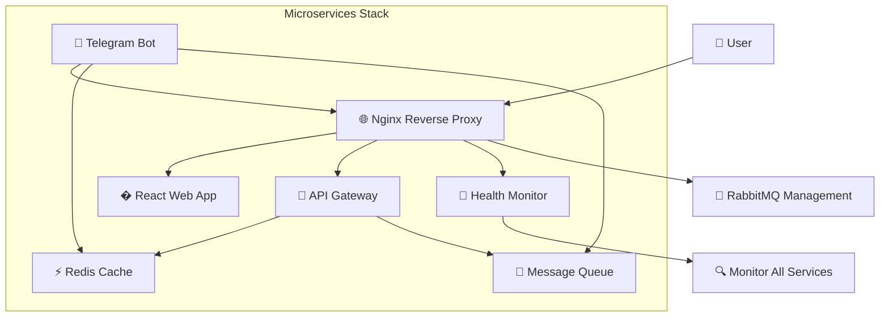

# 🎁 GiftMakeBot - Professional Multi-Environment Microservices Platform

[](https://www.docker.com/)
[](https://docs.docker.com/compose/)
[](https://www.php.net/)
[](https://reactjs.org/)
[** - Complete multi-environment setup
- **[🔧 Service Development Guide](docs/SERVICE_DEVELOPMENT_GUIDE.md)** - Adding new services
- **[🏥 Health API](services/health/index.php)** - Health monitoring details/img.shields.io/badge/License-Apache%202.0-green.svg)](LICENSE)

A robust, scalable Telegram bot platform built with Docker microservices architecture. Supports both **development** and **production** environments with comprehensive monitoring, health checks, and enterprise-grade security features.

## 🏗️ Architecture Overview



### 🔧 Core Services

| Service | Technology | Purpose | Ports |
|---------|------------|---------|--------|
| **🌐 Nginx** | nginx:alpine | Reverse proxy, load balancing, SSL termination | 80, 443 |
| **🤖 Telegram Bot** | PHP 8.1 FPM | Bot backend with webhook processing | Internal |
| **🔗 API Gateway** | PHP 8.1 FPM | RESTful API service with rate limiting | Internal |
| **📱 Web App** | React 18 + Vite | Modern frontend application | Internal |
| **⚡ Redis** | Redis 7 Alpine | High-performance caching and sessions | 6379 |
| **🐰 RabbitMQ** | RabbitMQ 3 + Management | Message queue with management UI | 5672, 15672 |
| **💊 Health Monitor** | PHP 8.1 FPM | System health and monitoring API | Internal |

## 🚀 Quick Start Guide

### 📋 Prerequisites

Before you begin, ensure you have:
- ✅ **Docker Desktop** (20.10+) or Docker Engine
- ✅ **Docker Compose** v2.0+
- ✅ **Git** for version control
- ✅ **PowerShell** (Windows) or **Bash** (Linux/Mac)
- ✅ **Telegram Bot Token** from [@BotFather](https://t.me/BotFather)

### ⚡ One-Command Deployment

#### 🔧 Development Environment
Perfect for local development with hot reload and debugging:

**Windows:**
```powershell
git clone https://github.com/blogchik/GiftMakeBot.git
cd GiftMakeBot
.\deploy-dev.ps1
```

**Linux/Mac:**
```bash
git clone https://github.com/blogchik/GiftMakeBot.git
cd GiftMakeBot
chmod +x deploy-dev.sh
./deploy-dev.sh
```

#### 🚀 Production Environment
Enterprise-ready with security and performance optimizations:

**Windows:**
```powershell
# ⚠️ Configure .env.production first!
.\deploy-prod.ps1
```

**Linux/Mac:**
```bash
# ⚠️ Configure .env.production first!
sudo ./deploy-prod.sh
```

## 🌍 Environment Configurations

### 🔧 Development Environment Features
- ✅ **Hot Reload**: Instant code changes
- ✅ **Debug Mode**: Detailed error reporting
- ✅ **Verbose Logging**: Complete request/response logs
- ✅ **CORS Enabled**: Frontend development support
- ✅ **Volume Mounts**: Live code editing
- ✅ **Non-Standard Ports**: Avoid conflicts (8080, 6380, etc.)
- ✅ **Safe Credentials**: Default development secrets

**Development URLs:**
```
🌐 Main Application:    http://localhost:8080
🔗 API Gateway:         http://localhost:8080/api
💊 Health Monitor:      http://localhost:8080/health
🐰 RabbitMQ Management: http://localhost:15673
📱 React Dev Server:    http://localhost:3001
⚡ Redis:               localhost:6380
```

### 🚀 Production Environment Features
- ✅ **SSL/TLS Encryption**: HTTPS with certificates
- ✅ **Rate Limiting**: API protection
- ✅ **Resource Limits**: CPU/Memory constraints
- ✅ **Security Headers**: OWASP protection
- ✅ **Monitoring**: Health checks and metrics
- ✅ **Log Management**: Structured logging
- ✅ **Credential Validation**: Security checks
- ✅ **Performance Optimization**: Nginx tuning

**Production URLs:**
```
🌐 Main Application:    https://your-domain.com
🔗 API Gateway:         https://your-domain.com/api
💊 Health Monitor:      https://your-domain.com/health
🐰 RabbitMQ Management: http://localhost:15672 (internal)
```

## 📊 System Health & Monitoring

### � Health Check API

Real-time monitoring of all services:

```bash
# Check overall system health
curl http://localhost:8080/health

# Or for production
curl https://your-domain.com/health
```

**Sample Health Response:**
```json
{
  "overall_status": "healthy",
  "timestamp": "2025-09-29 10:00:00 UTC",
  "services": {
    "nginx": {"status": "healthy", "message": "Proxy working"},
    "redis": {"status": "healthy", "ping_response": "PONG"},
    "rabbitmq": {"status": "healthy", "management_status": "accessible"},
    "telegram-bot": {"status": "healthy", "php_fpm": "running"},
    "api-gateway": {"status": "healthy", "api_endpoint": "working"},
    "web_app": {"status": "healthy", "http_status": "200 OK"},
    "system": {"status": "healthy", "uptime": "2d 14h 32m"}
  },
  "summary": {
    "total_services": 7,
    "healthy": 7,
    "warning": 0,
    "unhealthy": 0
  }
}
```

### 📈 Performance Metrics

**System Resources:**
- CPU usage and load average
- Memory consumption per service
- Network throughput
- Disk usage and I/O

**Service Metrics:**
- Request/response times
- Error rates and success rates
- Queue depths (RabbitMQ)
- Cache hit rates (Redis)

## 🔒 Security & Configuration

### 🛡️ Production Security Checklist

Before deploying to production:

#### Required Configuration Changes:
```bash
# Edit .env.production with secure values:
REDIS_PASSWORD=Your_Secure_Redis_Password_2025
RABBITMQ_USER=your_production_admin
RABBITMQ_PASSWORD=Your_Secure_RabbitMQ_Password_2025
RABBITMQ_ERLANG_COOKIE=unique_production_cookie_here
TELEGRAM_BOT_TOKEN=your_production_bot_token
TELEGRAM_SUPER_ADMIN_ID=your_telegram_user_id
```

#### SSL Certificate Setup:
```bash
# Add your SSL certificates:
mkdir ssl
# Copy your certificates:
cp your-cert.pem ssl/cert.pem
cp your-private-key.key ssl/private.key
```

#### System Security:
- [ ] **Firewall Configuration**: Block unnecessary ports
- [ ] **Regular Updates**: Automated security patches
- [ ] **Backup Strategy**: Database and configuration backups
- [ ] **Monitoring Setup**: Alerts and notifications
- [ ] **Access Control**: SSH key authentication
- [ ] **Network Security**: VPN or private networking

### � Environment Variables Reference

#### Core Application Settings
```bash
APP_ENV=development|production          # Environment type
DEBUG=true|false                       # Debug mode
LOG_LEVEL=debug|info|warning|error     # Logging verbosity
```

#### Network & Ports
```bash
HTTP_PORT=80|8080                      # Web server port
HTTPS_PORT=443|8443                    # SSL port
REDIS_PORT=6379|6380                   # Redis port (external)
RABBITMQ_PORT=5672|5673                # AMQP port
RABBITMQ_MANAGEMENT_PORT=15672|15673   # Management UI port
```

#### Service Configuration
```bash
REDIS_PASSWORD=your_redis_password
RABBITMQ_USER=admin_username
RABBITMQ_PASSWORD=rabbitmq_password
TELEGRAM_BOT_TOKEN=bot_token_from_botfather
TELEGRAM_SUPER_ADMIN_ID=your_telegram_id
```

## 🛠️ Development Workflow

### 🔄 Hot Reload Development

1. **Start Development Environment:**
   ```bash
   .\deploy-dev.ps1  # Windows
   ./deploy-dev.sh   # Linux/Mac
   ```

2. **Edit Code:** Changes are automatically reflected
   - PHP files: Instant updates via volume mounts
   - React components: Hot reload via Vite
   - Nginx config: Restart nginx service only

3. **View Logs:** Real-time monitoring
   ```bash
   # All services
   .\deploy-dev.ps1 -Logs
   
   # Specific service
   docker compose logs -f telegram-bot
   ```

4. **Debug Issues:** Comprehensive logging
   ```bash
   # Health check
   curl http://localhost:8080/health
   
   # Service status
   docker compose ps
   
   # Container logs
   docker compose logs nginx
   ```

### 🧪 Testing & Quality Assurance

**Manual Testing:**
- Health endpoints: `/health`
- API endpoints: `/api/v1/*`
- Web interface: Frontend functionality
- Bot commands: Telegram integration

**Performance Testing:**
```bash
# Load testing
curl -w "@curl-format.txt" -o /dev/null -s http://localhost:8080/api/users

# Memory usage
docker stats

# Response times
time curl http://localhost:8080/health
```

## 🚀 Production Deployment Guide

### 🔧 Pre-Deployment Steps

1. **Environment Preparation:**
   ```bash
   # Update system
   sudo apt update && sudo apt upgrade -y
   
   # Install Docker
   curl -fsSL https://get.docker.com -o get-docker.sh
   sh get-docker.sh
   ```

2. **Security Configuration:**
   ```bash
   # Configure firewall
   ufw allow 22/tcp      # SSH
   ufw allow 80/tcp      # HTTP
   ufw allow 443/tcp     # HTTPS
   ufw --force enable
   
   # SSL certificates
   certbot certonly --nginx -d your-domain.com
   ```

3. **Production Deployment:**
   ```bash
   git clone https://github.com/blogchik/GiftMakeBot.git
   cd GiftMakeBot
   
   # Configure production environment
   cp .env.production .env
   # Edit .env with your production values
   
   # Deploy
   sudo ./deploy-prod.sh
   ```

### 📊 Production Monitoring

**Log Management:**
```bash
# Centralized logging
docker compose logs --tail=100 -f

# Log rotation setup
sudo logrotate /etc/logrotate.d/docker-containers
```

**Health Monitoring:**
```bash
# Automated health checks
*/5 * * * * curl -f http://localhost/health || alert-script.sh
```

**Backup Strategy:**
```bash
# Database backup
docker exec redis redis-cli --rdb /backup/redis-backup.rdb

# Configuration backup
tar -czf backup-$(date +%Y%m%d).tar.gz .env docker-compose.yml ssl/
```

## 📚 Advanced Features

### 🔄 Message Queue Processing

**RabbitMQ Integration:**
- Queue management and monitoring
- Message persistence and reliability
- Dead letter queues for error handling
- Publisher confirms and consumer acknowledgments

**Queue Types:**
- **Command Queue**: Bot commands processing
- **Notification Queue**: User notifications
- **Analytics Queue**: Event tracking
- **Error Queue**: Failed message handling

### ⚡ Redis Caching Strategy

**Cache Types:**
- **Session Storage**: User sessions and state
- **API Response Cache**: Improved performance
- **Rate Limiting**: Request throttling
- **Temporary Data**: Short-lived information

**Cache Patterns:**
```php
// Cache-aside pattern
$data = $redis->get("user:$id");
if (!$data) {
    $data = $database->getUserById($id);
    $redis->setex("user:$id", 3600, serialize($data));
}
```

### 📱 Telegram Bot Features

**Webhook Processing:**
- Secure webhook validation
- Concurrent request handling
- Error recovery and retries
- Command routing system

**Bot Commands:**
- `/start` - Welcome message
- `/help` - Command documentation
- `/status` - Bot health status
- `/admin` - Administrative commands

## 🛠️ Troubleshooting Guide

### 🔍 Common Issues & Solutions

#### Port Conflicts
**Problem:** Port already in use
**Solution:**
```bash
# Check port usage
netstat -tulpn | grep :8080

# Change ports in environment files
HTTP_PORT=8081
```

#### Docker Build Failures
**Problem:** Build context issues
**Solution:**
```bash
# Clean Docker cache
docker system prune -a

# Rebuild with no cache
docker compose build --no-cache
```

#### SSL Certificate Issues
**Problem:** HTTPS not working
**Solution:**
```bash
# Verify certificates
openssl x509 -in ssl/cert.pem -text -noout

# Test SSL configuration
curl -vI https://your-domain.com
```

#### Health Check Failures
**Problem:** Services showing unhealthy
**Solution:**
```bash
# Check individual service logs
docker compose logs health

# Test service connectivity
docker exec nginx ping redis
```

### 📞 Support & Community

**Documentation:**
- � [Complete Deployment Guide](DEPLOYMENT.md)
- 🔧 [Service Configuration Guide](NEW_SERVICES_GUIDE.md)
- 💡 [Best Practices](docs/best-practices.md)

**Support Channels:**
- 🐛 **Issues**: [GitHub Issues](https://github.com/blogchik/GiftMakeBot/issues)
- 💬 **Discussions**: [GitHub Discussions](https://github.com/blogchik/GiftMakeBot/discussions)
- � **Contact**: [abduroziq@nuqtauz.com](mailto:abduroziq@nuqtauz.com)

**Contributing:**
1. Fork the repository
2. Create feature branch: `git checkout -b feature-name`
3. Make changes and test thoroughly
4. Update documentation
5. Submit pull request with detailed description

## 📄 License & Legal

This project is licensed under the Apache 2.0 License - see the [LICENSE](LICENSE) file for complete details.

**Third-party Libraries:**
- Docker & Docker Compose (Apache 2.0)
- PHP (PHP License v3.01)
- React (MIT License)
- Redis (BSD 3-Clause)
- RabbitMQ (Mozilla Public License 2.0)
- Nginx (2-clause BSD License)

---

<div align="center">

### � Ready to Build Something Amazing?

**[🚀 Start Development](#-quick-start-guide)** • **[📚 Read Docs](docs/DEPLOYMENT.md)** • **[💬 Join Discussion](https://github.com/blogchik/GiftMakeBot/discussions)**

Made with ❤️ by Jabborov Abduroziq

